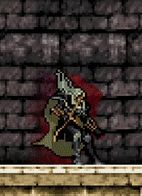

-----

  

-----

   

   

     
 Sobre mim:

    

  

<table>
<tr>

<td valign="top">

<ul>
<li>Me chamo Rafael Andrade e sou graduanda no curso de Direito e curso atualmente o curso de Ciências de Dados e IA na renomada PUC MINAS.</li>

<li>Aqui no meu GitHub você vai encontrar projetos, experimentos e estudos que fazem parte da minha jornada na área de dados. Muitos deles surgem de curiosidade, de desafios da faculdade ou de ideias que tive vontade de testar na prática.</li>

<li>Além da parte técnica, também gosto muito de contribuir com a comunidade acadêmica.</li>

<li>Meus hobbies são leitura, jogos,  e assistir a jogos do Botafogo.</li>

<li>Cinemáticamente falando, gosto de "Piratas do Caribe", "Senhor dos Aneis" e "Warhammer 40k".</li>

<li>📬 Se quiser conversar ou colaborar, você pode me encontrar pelo 
<a href="rafa25claudino@gmail.com">e-mail pessoal</a> ou 
<a href="rafaclaudino115@gmail.com">e-mail profissional</a>.</li>
</ul>

</td>

<td width="40%" align="center" valign="middle">

</td>

</tr>
</table>

-----
